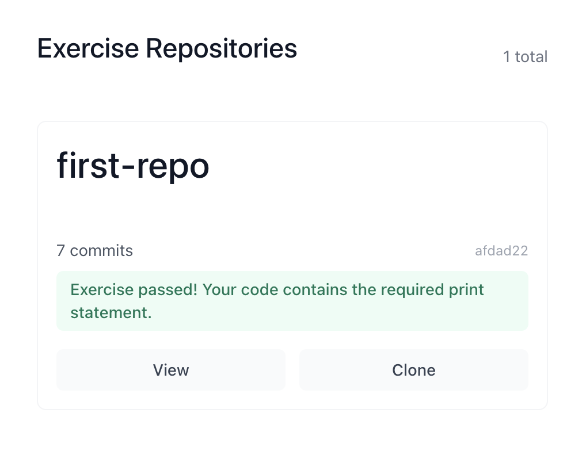

# Test

This fork connects to its original repository allowing my app to track commits and run code checks, sawadee-coding can monitor my progress through this. 

- [Github Oauth Apps](https://docs.github.com/en/apps/oauth-apps/building-oauth-apps/creating-an-oauth-app)
- [Octokit](https://github.com/octokit)

